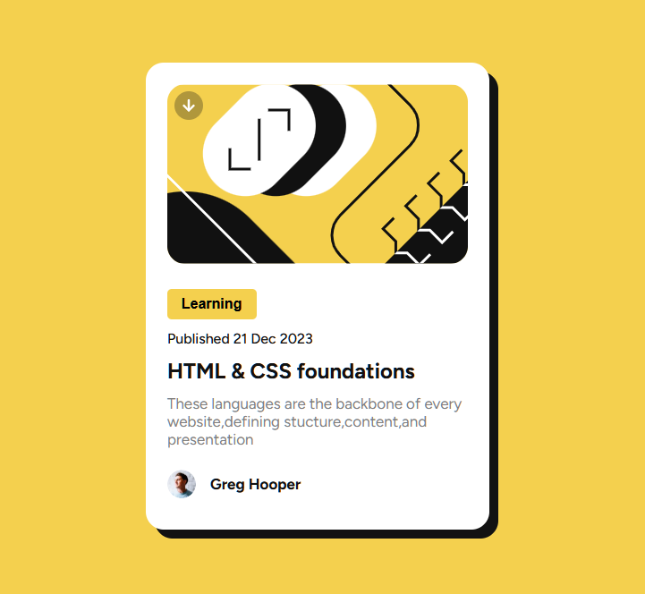

# Frontend Mentor - Blog preview card solution

This is a solution to the [Blog preview card challenge on Frontend Mentor](./design/desktop-preview.jpg). Frontend Mentor challenges help you improve your coding skills by building realistic projects.

## Table of contents

- [Overview](#overview)
  - [The challenge](# create Blog preview card)
  - [Screenshot](# "./design/Screenshot.png")
  - [Links](#links)
- [My process](#my-process)
  - [Built with](#Normal HTML & CSS)
  - [What I learned](# HTML & CSS [basic css & box model margin pading etc..])
  - [Useful resources](# HTML & CSS)
- [Author](#Gautam Kamlesh Yadav)

## Overview

### The challenge

Create Blog preview card to use HTML & CSS

### Screenshot



### Links

- Solution URL: [Add solution URL here](https://your-solution-url.com)
- Live Site URL: [Add live site URL here](https://your-live-site-url.com)

## My process

### Built with

- Semantic HTML5 markup
- CSS custom properties
- Flexbox
- CSS Box Model

### What I learned

```html
<h1>Some HTML code I'm proud of</h1>
```

```css
.proud-of-this-css {
  color: papayawhip;
}
```

### Continued development

HTML , CSS , Javascript , React ,

## Author

- Website - [Gautam Kamlesh Yadav](https://gautamyadav.netlify.app/)
- Frontend Mentor - [@Gautamy201](https://www.frontendmentor.io/profile/Gautamy201)
- Github - [Gautamy201](https://github.com/Gautamy201/)
